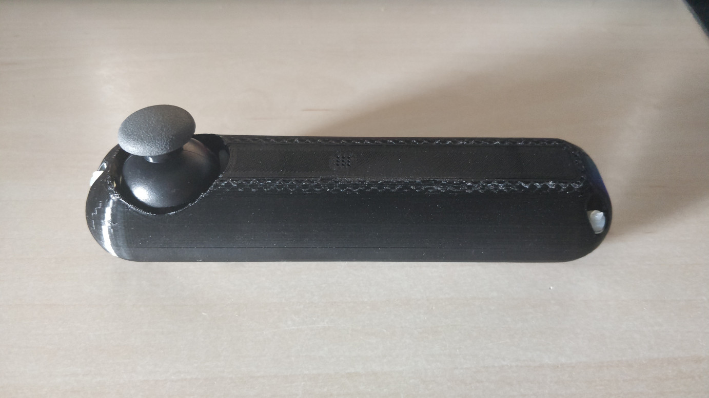
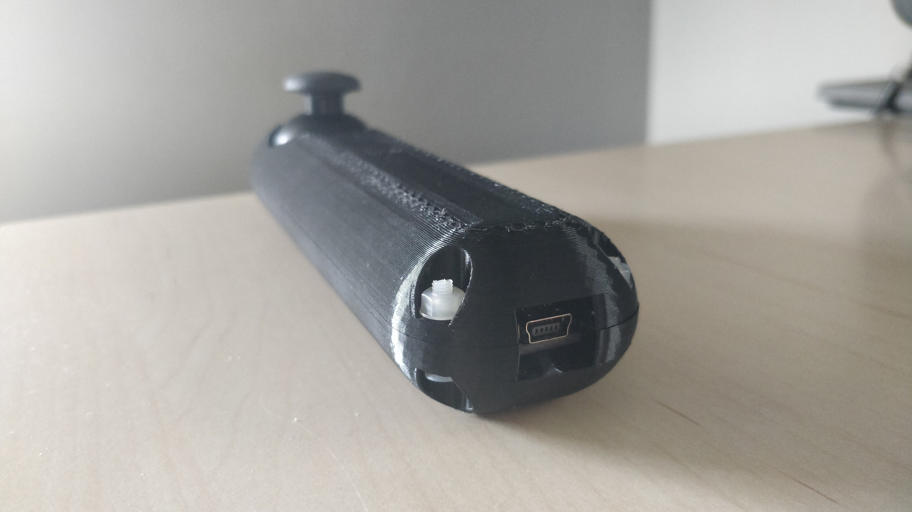
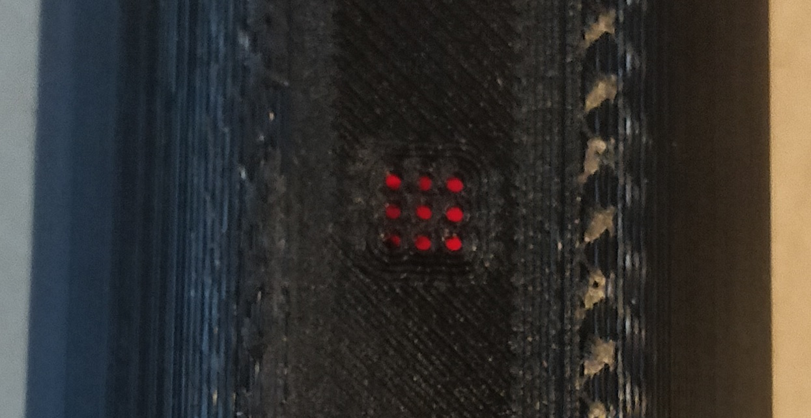
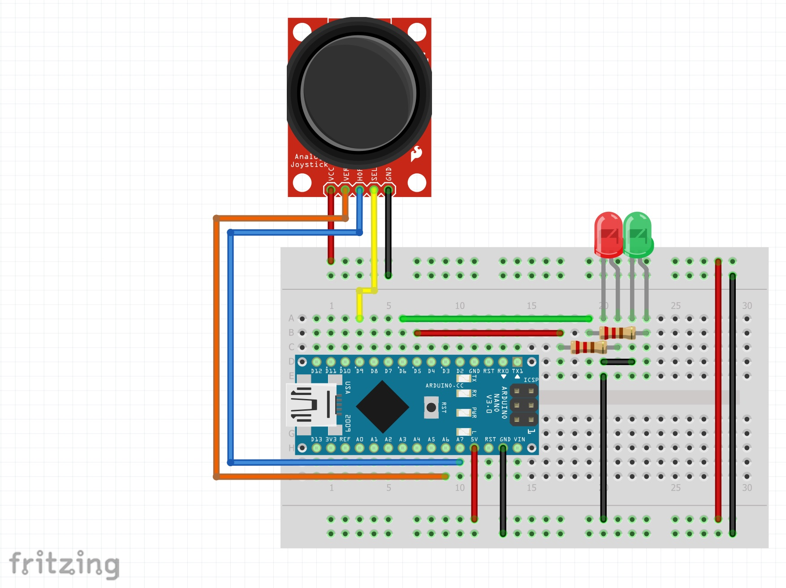
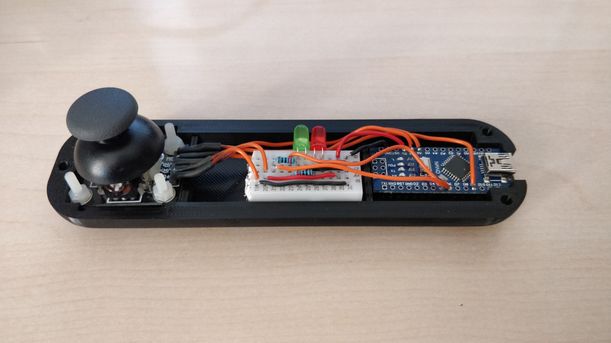
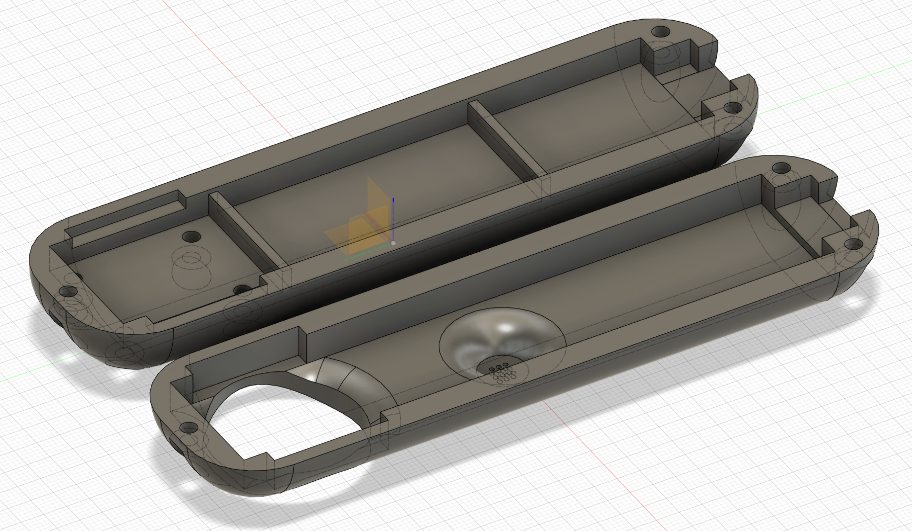

# Arduino JoyStick :joystick:

A simple joystick made of an arduino nano to emulate mouse actions and movements.

In this project I used a Arduino Nano to emulate mouse actions and movements. Since the nano does not have native support for HID I had to create a python program that received the joystick data via serial messages and translated them to actual mouse actions and movements.

## How it works

The joystick is connected to the PC via USB-A to Mini-USB. From the PC you simply run [the python program](src/python_joystick_handler/python_joystick_handler.py) and the joystick will automatically connect to the program.

When the joystick is not connected to the program, the LED will be RED. And when the joystick is connected to the program, the LED will be GREEN. See image below:

## Electronics

The components required are the following:

- Arduino Nano
- Analog JoyStick x1
- Red LED x1
- Green LED x1
- 220Ω resistor x2

The [fritzing](https://github.com/fritzing/fritzing-app) file of the hardware schematics can be found [here](electronics/schematics.fzz).

## Design

The stl file can be found [here](design/joystick_v10_final_split.stl).

## Setup environment

The only python library that is needed is pyserial defined in [requirements.txt](src/python_joystick_handler/requirements.txt)
